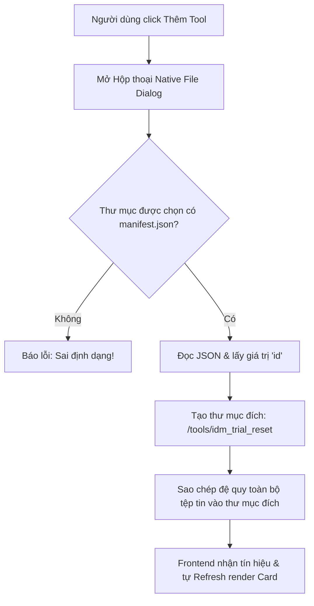

# 🛠️ Reset Hub AIO - Dashboard Quản Lý Công Cụ Hệ Thống

Chào mừng bạn đến với **Reset Hub**! Đây là một nền tảng Dashboard Desktop xây dựng trên **Tauri v2** + **Rust** kết hợp với giao diện hiện đại phong cách Dark-Glassmorphism. 

Hệ thống hoạt động theo cơ chế **Config-driven UI (Cấu hình động)** cho phép bạn dễ dàng thêm mới, phân phối và chạy các công cụ reset/tối ưu hệ thống bằng cách khai báo file cấu hình mà không cần động vào mã nguồn ứng dụng chính.

---

## 📂 Cấu Trúc Thư Mục Công Cụ Chuẩn (Plugin Folder Structure)

Mỗi công cụ (như `resetIDM`) muốn được tích hợp vào Hub cần được đặt trong một thư mục riêng biệt, có tổ chức chặt chẽ như sau:

```text
my_tool_folder/           <-- [Tên thư mục công cụ tùy chọn]
├── manifest.json         <-- [BẮT BUỘC] Tệp cấu hình định nghĩa thông tin & logic tool
├── icon.png              <-- [TÙY CHỌN] Biểu tượng hiển thị trên Card Hub
└── my_logic.exe          <-- [BẮT BUỘC] File thực thi (compile từ AutoIt, Batch, C++,...)
```

> [!IMPORTANT]
> **Quy tắc đặt file thực thi:**
> File thực thi nên được biên dịch sẵn sang dạng `.exe` để tương thích tối ưu với backend Windows của Rust, và nên được lập trình để chạy âm thầm (Silent/Headless) để không làm gián đoạn trải nghiệm Dashboard.

---

## 📄 Chuẩn Đặc Tả Cấu Hình `manifest.json`

Tệp `manifest.json` là "bộ não" giúp Hub hiểu được cách thức vẽ giao diện và ra lệnh cho hệ điều hành. Dưới đây là đặc tả chuẩn hóa cho tệp này:

### 1. Bảng giải nghĩa các trường dữ liệu (Schema Definitions)

| Trường (Field) | Kiểu dữ liệu | Mô tả | Bắt buộc? |
| :--- | :--- | :--- | :--- |
| `id` | String | Mã duy nhất của công cụ (viết liền, chữ thường, ví dụ: `idm_trial_reset`). Được dùng làm tên thư mục đích khi Import. | Có |
| `name` | Object | Chứa các khóa `vi`, `en` tương ứng với Tên công cụ theo ngôn ngữ. | Có |
| `description` | Object | Chứa các khóa `vi`, `en` mô tả chi tiết chức năng công cụ. | Có |
| `icon` | String | Đường dẫn ảnh/Icon (Hỗ trợ link HTTP/HTTPS trực tuyến hoặc đường dẫn tương đối). | Có |
| `version_check`| Object/Null | Định nghĩa vùng chứa thông tin phiên bản của phần mềm cần can thiệp trên Windows. | Không |
| `version_check.hive` | Enum | Phân vùng Registry. Chỉ chấp nhận: `"HKEY_CURRENT_USER"` hoặc `"HKEY_LOCAL_MACHINE"`. | (Nếu có parent) |
| `version_check.path` | String | Đường dẫn Registry con (ví dụ: `Software\DownloadManager`). Chú ý dùng dấu gạch chéo kép `\\`. | (Nếu có parent) |
| `version_check.key` | String | Tên khóa cụ thể chứa dữ liệu phiên bản (ví dụ: `Serial`, `Version`). | (Nếu có parent) |
| `actions` | Array | Mảng các Object hành động (nút bấm) hiển thị bên dưới Card. | Có |
| `actions[].label`| Object | Chứa các khóa `vi`, `en` là chữ hiển thị trên mặt Nút bấm. | Có |
| `actions[].file` | String | Tên chính xác của file thực thi nằm cùng thư mục (ví dụ: `ResetIDM_Core.exe`). | Có |
| `actions[].require_admin`| Boolean| Chế độ kích hoạt yêu cầu quyền Quản trị viên cao cấp. | Có |

---

### 2. Mã nguồn cấu hình Mẫu Chuẩn của `resetIDM`

Bạn hãy sử dụng mẫu cấu hình thực tế dưới đây để áp dụng cho công cụ IDM Reset:

```json
{
  "id": "idm_trial_reset",
  "name": {
    "vi": "IDM Trial Reset Tool",
    "en": "IDM Trial Reset Utility"
  },
  "description": {
    "vi": "Tự động đóng tiến trình IDMan.exe, dọn dẹp sâu các giá trị Trial trong Registry để phục hồi 30 ngày dùng thử hoàn toàn sạch sẽ.",
    "en": "Force close IDMan.exe and wipe Trial Registry keys to completely restore pristine 30-day evaluation period."
  },
  "icon": "https://cdn-icons-png.flaticon.com/512/888/888853.png",
  "version_check": {
    "hive": "HKEY_CURRENT_USER",
    "path": "Software\\DownloadManager",
    "key": "Serial"
  },
  "actions": [
    {
      "label": {
        "vi": "🚀 Bắt đầu Reset ngay",
        "en": "🚀 Execute Reset Now"
      },
      "type": "execute_binary",
      "file": "ResetIDM_Core.exe",
      "require_admin": true
    }
  ]
}
```

---

## 🔄 Cách thức Hoạt Động khi Import (Thêm Tool)

Khi bạn nhấp chọn **"Thêm Tool Mới"** và trỏ tới thư mục chứa bộ cấu hình trên, luồng xử lý ngầm sẽ diễn ra như sau:



## 🚀 Lệnh Vận Hành Nhanh

Mở cửa sổ terminal tại thư mục dự án và thực thi các lệnh sau:

* **Biên dịch & Chạy thử (Development Mode):**
  ```powershell
  $env:Path = "D:\Dev\Tools\.cargo\bin;" + $env:Path; npm run tauri dev
  ```

* **Đóng gói phần mềm cài đặt (.MSI / .EXE):**
  ```powershell
  $env:Path = "D:\Dev\Tools\.cargo\bin;" + $env:Path; npm run tauri build
  ```
